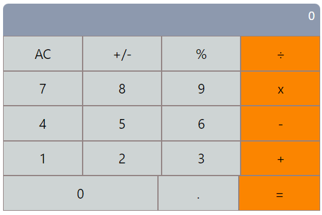

# MATH MAGICIAN

This is an application that is used to handle simple mathematical operations

## Languages

- React

## Screenshoot

## Live Demo
- [live demo](https://Josphat205.github.io/math-magician/)

## Josphat Kiploman

- [@Github](https://github.com/Josphat205)

- [@Linkedin](https://www.linkedin.com/in/josphat-kiploman-797430236/)

## 🤝 Contributing

Contributions, issues, and feature requests are welcome!

## Show your support

Give a ⭐ if you like this project!

## 📝 License

This project is [MIT](./MIT.md) licensed.
